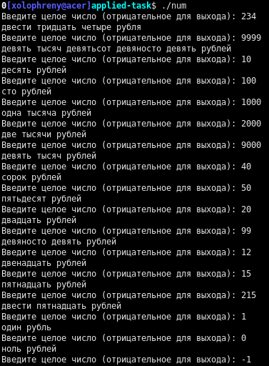

# num-format

Перевести число в количество рублей, написанное словами.

## Использование

### Скачивание

Доступны собранные релизы программы на странице "Релизы"

### Сборка

Компилировать `num.cpp`, например: `g++ num.cpp -o num`

### Запуск

Открыть полученную программу в текстовой консоли (терминале)

---
*Этот репозиторий является учебным заданием*

*This repo is part of a study task*
